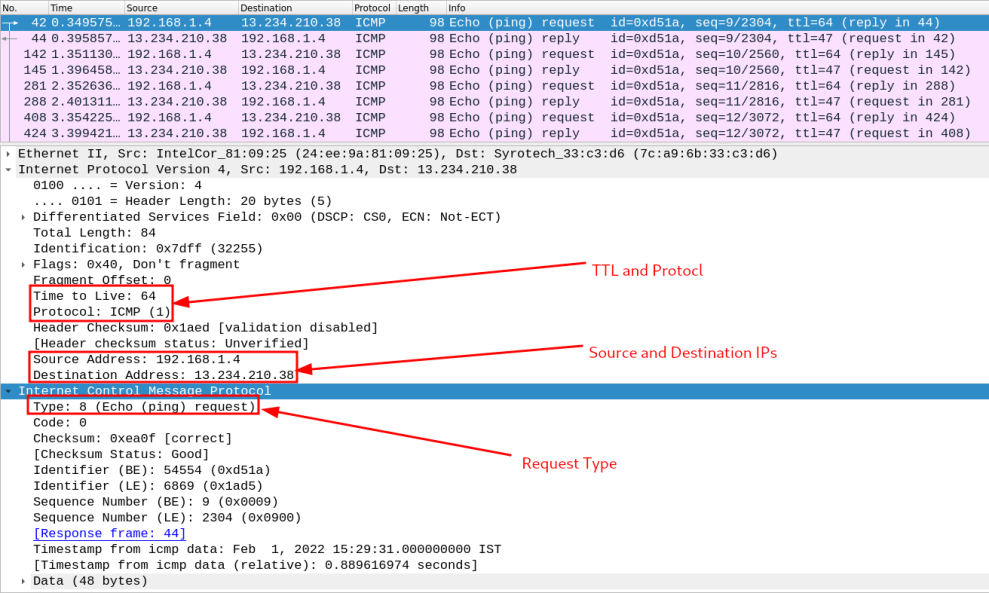
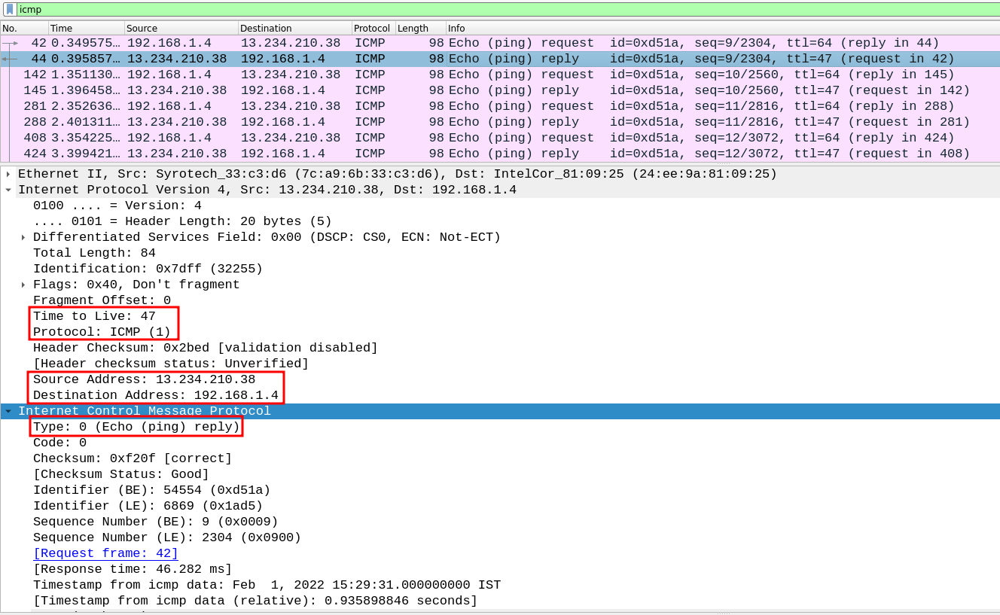
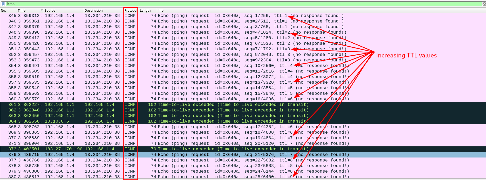

# Assignment 3

- **Name:** Arnab Sen
- **Roll:** 510519006
- **Gsuite:** 510519006.arnab@students.iiests.ac.in
- **Subject:** Computer Networks Lab (CS 3272)

## Question 1

Analyse the packets (across all layers) exchanged with your computer while executing the following commands:

1. `ping`
2. `traceroute`
3. `dig`
4. `arp`
5. `wget`

## Answer 1

### 1. `ping`

`ping` uses the ICMP protocol to send packets to a destination. Running the command `ping www.github.com` in a terminal and then capturing the packets we see something like this:



- this is a request packet sent by the host to the destination.
- the Time To Live (TTL) is set to `64`.
- Protocol is `ICMP`.
- the packet is of `ICMP type 8 (Echo Request)`.



- this is a reply packet sent by the destination to the host.
- the Time To Live (TTL) is set to `47`.
- Protocl is also `ICMP`.
- the packet is of `ICMP type 0 (Echo Reply)`.

| Layer | Protocol Used |
|---|---|
| Internet | ICMP |

> **Note :** ICMP is not associated with a transport layer protocol such as TCP or UDP.

### 2. `traceroute`

The way `traceroute` works is by sending packets with increasing values of the Time To Live (TTL) to the destination.



Now, ideally we should see some Time to Live exceeded responses. So if we add that filter in wireshark.


The IPs we see in the Source field exactly match with the IPs we see in the traceroute command.

Since I used the `traceroute` with `-I` flag, it uses `ICMP` protocol.

| Layer | Protocol Used |
|---|---|
| Internet | ICMP |

### 3. `dig`

We know `dig` command uses the DNS protocol, so filtering the packets in wireshark we see:


Analysing the request:


- the query was made to the DNS server `10.10.0.1`.
- Query was for `www.github.com` for A record.

Analysing the response:


- In the answers we received a CNAME record for `www.github.com`. Basically saying both `www.github.com` and `github.com` are the same.
- Then received a A record for `github.com` with address `13.234.210.38`.
- Protocol used is `DNS`.

| Layer | Protocol Used |
|---|---|
| Application | DNS |
| Transport | UDP |
| Internet | IP |

### 4. `arp`

`arp` maintains a table of mac address and their corresponding IP address. So, when we run the `arp` command, it sends a broadcast packet to all the hosts in the network. Analyzing the packets we see:


- Destination: Broadcast `(ff:ff:ff:ff:ff:ff)`
- Protocol is `ARP`

| Layer | Protocol Used |
|---|---|
| Internet | ARP |

### 5. `wget`

`wget` makes a GET HTTP(S) request to the server and then downloads the file. So, we can see the packets sent by the host to the server:


- First packet was sent with `SYN` flag set.
- Second packet received with `SYN-ACK` flag set.
- Finally, a third packet was sent with `ACK` flag set.
- Now, once the connection was setup, data transfer took place from the server to my machine.

Looking at a packet of Data transfer we see:


- most of the data is all gibberish, because it has been end-to-end encrypted. The request was made through an `HTTPS` protocol which makes it impossible for sniffers like wireshark to decode the data.
- Application Layer protocol: `HTTPS`.
- Trasport Layer protocol: `TCP`.

| Layer | Protocol Used |
|---|---|
| Application | HTTPS |
| Transport | TCP |
| Internet | IP |

## Question 2

Capture the packets while sending/receiving telnet request/response between your computer and a custom server running the telnet daemon. What is your observation while analysing the application layer data?

## Answer 2

> I have set up a telnet daemon in a virtual machine which is in bridged network mode. My VM's IP is `192.168.1.3`. Since I don't have any service running on port 23 (telnet), started a netcat server on port 23 with `nc -lvp 23`.

Making a telnet request to the server by the command:

```bash
telnet 192.168.1.3 23
```


It first uses `TCP` protocol to establish connection. My machine first sends a packet with `SYN` flag to which the server responds with `SYN-ACK`. And then finally my machine sends a packet with `ACK` flag to the server, establishing the connection.

Now, after that when the data transfer happens it uses the `TELNET` protocol. So, I can see the following packets:


One thing to note is that the data transfer is not encrypted, and anyone sniffing the network can easily decode the data.

## Question 3

Capture the packets while sending/receiving ssh request/response between your computer and one of the department servers. What is your observation while analysing the application layer data?

## Answer 3

SSH uses asymmetric cryptography to establish a shared secret key and then symmetric cryptography for bulk encryption with that key.

So, the first step after initial connection is to exchange the public key. Here we can see two packets that are involved in the key exchange, we can also see the respective algorithms used.


After this, the server is verified and both the parties negotiate a session key using a version of something called the Diffie-Hellman algorithm. This algorithm is designed in such a way that both the parties contribute equally in generation of session key. The generated session key is shared symmetric key i.e. the same key is used for encryption and decryption.


Once, that is done the rest of the packets are then sent encrypted.


## Question 4

Enter the URL: [http://gaia.cs.umass.edu/wireshark-labs/INTRO-wireshark-file1.html](http://gaia.cs.umass.edu/wireshark-labs/INTRO-wireshark-file1.html) and capture packets using Wireshark. After your browser has displayed the INTRO-wireshark-file1.html page (it is a simple one line of congratulations), stop Wireshark packet capture. Answer the following from the packets captured:

- a. How long did it take from when the HTTP GET message was sent until the HTTP OK reply was received?
- b. What is the Internet address of the gaia.cs.umass.edu? What is the Internet address of your computer? Support your answer with an appropriate screenshot from your computer.

## Answer 4

### a. How long did it take from when the HTTP GET message was sent until the HTTP OK reply was received?

The first GET request was made in `1.213296754 s`.

```python
[Time since first frame in this TCP stream: 1.213296754 seconds]
```


The response was received in `2.527798624 s`.

```python
[Time since first frame in this TCP stream: 2.527798624 seconds]
```


So, time taken is `2.527798624 - 1.213296754` = **`1.31450187 s`**.

### b. What is the Internet address of the gaia.cs.umass.edu? What is the Internet address of your computer? Support your answer with an appropriate screenshot from your computer

- Internet address of the `gaia.cs.umass.edu` is `Destination Address: 128.119.245.12`
- Internet address of my computer is `Source Address: 192.168.1.4`


## Question 5

Start the Wireshark packet capturing service. Enter the URL: [https://www.gmail.com](https://www.gmail.com) on your browser and sign-in to your gmail account by providing credentials (Username/Password). Answer the following from the captured packets:

- a. Is there any difference in the application layer protocol?
- b. How it is different from the HTTP data you analysed in the above problem

## Answer 5

### a. Is there any difference in the application layer protocol?

Yes, the current application layer protocol is `TLS`. A primary use case of TLS is encrypting the communication between web applications and servers, such as web browsers loading a website.

But, in the previous case it was just `HTTP`.

### b. How it is different from the HTTP data you analysed in the above problem?

Previously, the protocol used was simple HTTP. As a result sniffers like wireshark could decode the data. Here is an example:


Clearly, we can see the message in plain text.

But, with `gmail.com` the connection is TLS protected. So, the data is encrypted.


here, we cannot decode the text because it is encrypted. This way anyone sniffing the netwrok cannot find the Username and Password used.

---
